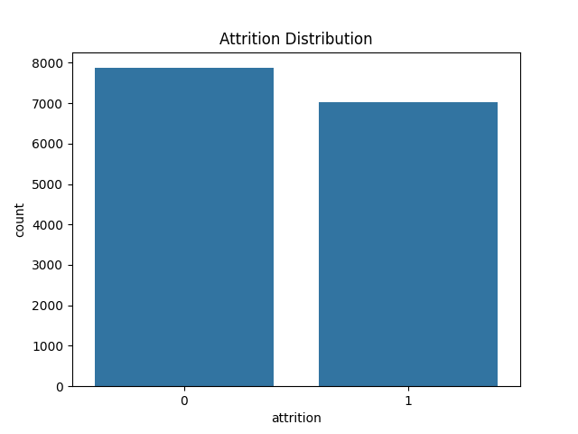
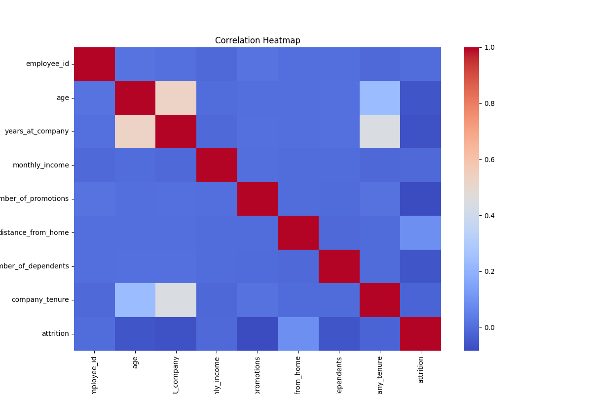

# 🚀 Employee Attrition Prediction (Machine Learning Project)

An end-to-end machine learning project designed to predict employee attrition using real-world HR data. This project demonstrates a full data science workflow from data preprocessing to model evaluation and comparison.

---

## 📌 Project Overview

Employee attrition is a critical challenge for organizations. This project builds predictive models to identify employees at risk of leaving, enabling proactive decision-making.

---

## 📊 Exploratory Data Analysis (EDA)

### Attrition Distribution


### Correlation Heatmap


### Feature Importance


---

## 🧠 Models Implemented

- Logistic Regression  
- Random Forest  
- Neural Network (MLPClassifier)

---

## 📈 Model Comparison

| Model                | Accuracy | F1 Score | ROC-AUC |
|---------------------|----------|----------|---------|
| Logistic Regression | XX%      | XX%      | XX%     |
| Random Forest       | XX%      | XX%      | XX%     |
| Neural Network (MLP)| XX%      | XX%      | XX%     |

> 📌 *Update this table with your actual results from `outputs/model_comparison.csv`*

---


## ⚙️ Project Structure
employee-attrition-ml-project/
│
├── data/
│ └── raw/
│ └── employee_attrition.csv
│
├── models/
│
├── outputs/
│ ├── figures/
│ └── reports/
│
├── src/
│ ├── config.py
│ ├── preprocess.py
│ ├── eda.py
│ ├── train_models.py
│ ├── model_comparison.py
│ ├── nn_model.py
│
├── README.md
├── requirements.txt
└── .gitignore


---

## 🔄 Workflow

1. Data Cleaning & Preprocessing  
2. Exploratory Data Analysis (EDA)  
3. Feature Engineering  
4. Model Training  
5. Model Evaluation  
6. Model Comparison  
7. Model Saving  

---

## 🛠️ Technologies Used

- Python  
- Pandas  
- NumPy  
- Scikit-learn  
- Matplotlib  
- Seaborn  

---

## 🚀 How to Run

```bash
# Activate virtual environment
.venv\Scripts\Activate.ps1

# Install dependencies
pip install -r requirements.txt

# Run EDA
python -m src.eda

# Train models
python -m src.train_models

# Compare models
python -m src.model_comparison

# Run neural network
python -m src.nn_model
-------

## Key Insights

Employees with lower job satisfaction show higher attrition risk
Lower income levels correlate with increased turnover
Work-life balance significantly impacts retention
Certain departments exhibit higher attrition patterns

## Future Improvements
Hyperparameter tuning (GridSearch / RandomSearch)
Deploy model using FastAPI
Add SHAP for model explainability
Integrate real-time prediction API

Author
Mohammad Samad
Aspiring Data Scientist | Machine Learning | Python

